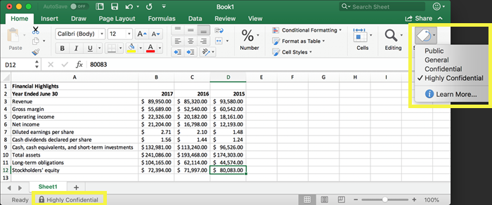
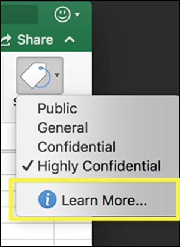
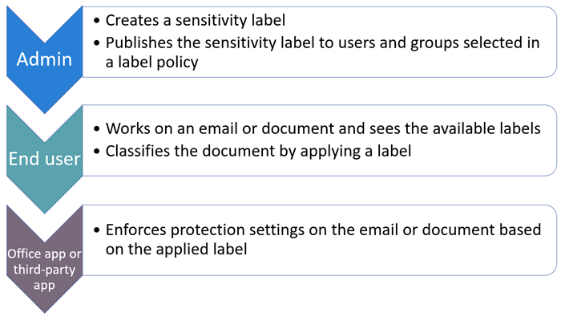
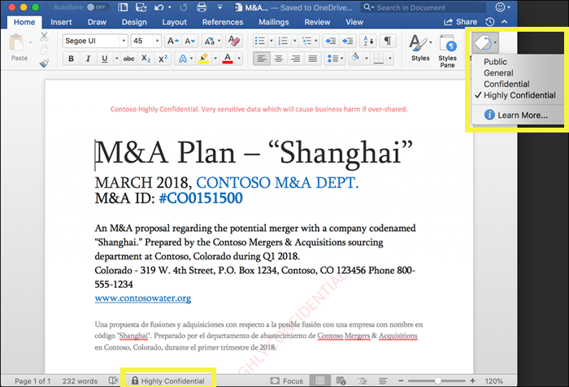

# Overview of sensitivity labels

To get their work done, people in your organization need to collaborate with others both inside and outside the organization. This means that content no longer stays behind a firewall – it roams everywhere, across devices, apps, and services. And when it roams, you want it to do so in a secure, protected way that meets your organization’s business and compliance policies.

With sensitivity labels in Office 365, you can classify and help protect your sensitive content, while making sure that your people’s productivity and ability to collaborate isn’t hindered.

You can use sensitivity labels to:
  
- **Enforce protection settings such as encryption or watermarks on labeled content.** For example, your users can apply a Confidential label to a document or email, and that label can encrypt the content and apply a Confidential watermark.    

- **Protect content in Office apps across different platforms and devices.** Sensitivity labels work in Office apps on Windows, Mac, iOS, and Android. Support for Office web apps is coming soon.
    
- **Prevent sensitive content from leaving your organization on devices running Windows**, by using endpoint protection in Microsoft Intune. After a sensitivity label has been applied to content that resides on a Windows device, endpoint protection can prevent that content from being copied to a third-party app, such as Twitter or Gmail, or being copied to removable storage, such as a USB drive.

- **Extend sensitivity labels to third-party apps and services.** With the Microsoft Information Protection SDK, third-party apps on Windows, Mac, and Linux can read sensitivity labels and apply protection settings. Support for apps on iOS and Android is coming soon.

- **Classify content without using any protection settings.** You can also simply assign a classification to content (like a sticker) that persists and roams with the content as it's used and shared. You can use this classification to generate usage reports and see activity data for your sensitive content. Based on this information, you can always choose at a later time to apply protection settings.
    
In all of these cases, sensitivity labels in Office 365 can help you take the right actions on the right content. With sensitivity labels, you can classify data across your organization and enforce protection settings based on that classification.
  
You create sensitivity labels in the Office 365 Security &amp; Compliance Center. The Security & Compliance Center is now the single place to configure sensitivity labels and policies across Azure Information Protection and Office 365. These sensitivity labels can be used by Azure Information Protection, Office apps, and Office 365 services.

For Azure Information Protection customers, you can use your Azure Information Protection labels in the Security & Compliance center, and your labels will be synced with the Azure portal in case you choose to perform additional or advanced configuration. **Azure Information Protection labels and Office 365 sensitivity labels are fully compatible with each other.** This means, for example, if you have content labeled by Azure Information Protection, you won’t need to reclassify or relabel your content.

## What a sensitivity label is

When you assign a sensitivity label to a document or email, it’s simply like a tag that is:

- **Customizable.** You can create categories for different levels of sensitive content in your organization, such as Personal, Public, General, Confidential, and Highly Confidential.

- **Clear text.** Because the label is in clear text, it’s available for third-party apps and services to apply protective actions to labeled content.

- **Persistent.** After a sensitivity label is applied to content, it persists in the metadata of that email or document. This means the label roams with the content, including the protection settings, and becomes the basis for applying and enforcing policies.

In the Office apps, a sensitivity label simply appears as a tag on an email or document.

Each item of content can have a single sensitivity label applied to it. But note that an item can have both a single sensitivity label and a single [retention label](labels.md) applied to it.

## What sensitivity labels can do

After a sensitivity label is applied to an email or document, the protection settings for that label are enforced on the content. With a sensitivity label, you can:

- **Encrypt** email only or both email and documents. You can choose which users or group have permissions to perform which actions and for how long. For example, you can choose to allow users in a specific domain outside your organization to have permissions to review the content for only 7 days after the content is labeled.

- **Mark the content** by adding custom watermarks, headers, or footers to email or documents that have the label applied. (Note that watermarks are applied only to documents, not email, and they're limited to 255 characters. Also, headers and footers are limited to 1024 characters, except in Excel, where they're limited to 253 characters.)

    

- **Prevent data loss** by turning on endpoint protection in Intune. If sensitive content gets downloaded, you can help prevent the loss of data from Windows devices. For example, you can’t copy labeled content into Dropbox, Gmail, or USB drive. Before your sensitivity labels can use Windows Information Protection (WIP), you first need to create an app protection policy in the Azure portal. For more information, see [How Windows Information Protection protects files with a sensitivity label](https://docs.microsoft.com/en-us/windows/security/information-protection/windows-information-protection/how-wip-works-with-labels?branch=vsts17546553).

All of these options are available when you create a label in the Security & Compliance Center.

### Label priority (order matters)

When you create your sensitivity labels in the Security & Compliance Center, they appear in a list on the **Sensitivity** tab on the **Labels** page. In this list, the order of the labels is important because it reflects their priority. You want your most restrictive sensitivity label, such as Highly Confidential, to appear at the **bottom** of the list, and your least restrictive sensitivity label, such as Public, to appear at the **top**.

A document or email can have only a single sensitivity label applied to it. If you require your users to provide a justification for changing the label to a lower classification, the order of this list determines what's a lower classification.

### Sublabels (grouping labels)

With sublabels, you can group one or more labels below a header that a user sees in an Office app. For example, under Confidential, your organization might use several different labels for specific types of that classification. In this example, the label Confidential is simply a text label with no protection settings, so it can’t be applied to content. Instead, users must choose Confidential to view the sublabels, and then they can choose a sublabel to apply to content.

Sublabels are simply a way to present labels to users in logical groups. Sublabels don’t inherit any settings from the label they’re under.

### Editing or deleting a sensitivity label

If you delete a sensitivity label in the Security & Compliance Center, note that the label is not removed from content, and any protection settings continue to be enforced on the content.

If you edit a sensitivity label in the Security & Compliance Center, the version of the label that was applied to content is what’s enforced on that content.

## What label policies can do

After you create your sensitivity labels, you need to publish them, to make them available to people in your organization, who can then apply the labels to content. Unlike retention labels, which are published to locations, such as all Exchange mailboxes, sensitivity labels are published to users or groups. Sensitivity labels then appear in Office apps for those users and groups.

With a label policy, you can:

- **Choose which users and groups see the labels.** Labels can be published to any email-enabled security group, distribution group, Office 365 group, or dynamic distribution group.

- **Apply a default label** to all new documents and email created by the users and groups included in the label policy. This default label can set a base level of protection settings that you want applied to all your content.

- **Require a justification for changing a label.** If content is marked Confidential and a user wants to remove that label or replace it with a lower classification, such as a label named Public, you can require that the user provide a justification when performing this action. These justifications will be available for the admin to review. We’re currently working on a report where admins can view the user justifications.

    

- **Provide help link to a custom help page.** If your users aren’t sure what your sensitivity labels mean or how they should be used, you can provide a Learn More URL that appears at the bottom of the Sensitivity label menu in the Office apps.

    

After you create a label policy and assign sensitivity labels to users and groups, those people will see those labels available in the Office apps in an hour or less.

## How to get started

Getting started with sensitivity labels is a quick process:

1. **Define the labels.** First, you want to establish your taxonomy for defining different levels of sensitive content. You should use common names or terms that make sense to your users. For example, you can start with labels such as Personal, Public, General, Confidential, and Highly Confidential. You can use sublabels to group similar labels by category. Also, when you create a label, a tool tip is required, which appears in the Office apps when a user hovers over a label option on the Ribbon.

1. **Define what each label can do.** Then, configure the protection settings you want associated with each label. For example, lower sensitivity content (a “General” label) might simply have a header or footer applied to it, while higher sensitivity content (a “Confidential” label) may have a watermark, encryption, and WIP applied to it, to help ensure that only privileged users can access it.
 
1. **Define who gets the labels.** After you define your organization’s labels, you publish them in a label policy that controls which users and groups see those labels. A single label is reusable – you define it once, and then you can include it in several label policies assigned to different users. But in order for a label to be assigned to content, you must first publish that label so that it’s available in Office apps and other services. When just starting out, you can pilot your sensitivity labels by assigning them to just a few people.

Here’s the basic flow of what the admin, user, and Office app do to make sensitivity labels work.

## Where sensitivity labels can appear

Sensitivity labels appear in the UI of Office apps. To view the current availability for specific apps and platforms, see **[Where is the feature available today?](https://support.office.com/en-us/article/apply-sensitivity-labels-to-your-documents-and-email-within-office-2f96e7cd-d5a4-403b-8bd7-4cc636bae0f9?ad=US&ui=en-US&rs=en-US#bkmk_whereavailable)**

### Office apps on Windows

In Office apps on devices running Windows, sensitivity labels appear on the **Sensitivity** button, on the **Home** tab on the Ribbon. The label applied also appears in the Status bar at the bottom of the window.

Coming soon is native support for sensitivty labels in Office apps on Windows.

If you're an existing Azure Information Protection customer, you can deploy the Azure Information Protection unified labeling client, which supports sensitivity labels and is coming soon. (Check back for a link to information about how to deploy the client.) We’re currently working on native support for sensitivity labels in Office apps on Windows, so that the Azure Information Protection unified labeling client will no longer be required.

### Office apps on Mac

In Office apps on Mac devices, sensitivity labels appear on the **Sensitivity** button, on the **Home** tab on the Ribbon. The label applied also appears in the Status bar at the bottom of the window.

### Office apps on iOS

In Office apps on iOS devices, sensitivity labels appear on the **Sensitivity** button, on the **Home** tab on the Ribbon. The label applied also appears in the Status bar at the bottom of the window.

### Office apps on Android

In Office apps on Android devices, sensitivity labels appear on the **Sensitivity** button, on the **Home** tab on the Ribbon. The label applied also appears in the Status bar at the bottom of the window.

### More information on sensitivity labels in Office apps

- [Apply sensitivity labels to your documents and email within Office](https://support.office.com/en-us/article/apply-sensitivity-labels-to-your-documents-and-email-within-office-2f96e7cd-d5a4-403b-8bd7-4cc636bae0f9)
- [Known issues when you apply sensitivity labels to your Office files](https://support.office.com/en-us/article/known-issues-when-you-apply-sensitivity-labels-to-your-office-files-b169d687-2bbd-4e21-a440-7da1b2743edc)

## How sensitivity labels work with existing Azure Information Protection labels

Azure Information Protection users are currently able to classify and label content on Windows by using the Azure Information Protection unified labeling client. Existing Azure Information Protection labels work seamlessly with new sensitivity labels. This means you can:

- Keep your existing Azure Information Protection labels on documents and email.
- Keep your existing Azure Information Protection label configuration.

If you are using Azure Information Protection labels, for now we recommend that you avoid creating new labels in Security & Compliance Center until after you’ve completed your migration. The [Azure Information Protection migration topic](https://docs.microsoft.com/en-us/azure/information-protection/configure-policy-migrate-labels) has important information and some specific caveats. If you are not yet ready to migrate your production tenants to sensitivity labels, there is no cause for concern: for the moment, your users can continue using the Azure Information Protection client, and admins can continue using the Azure portal for management.

## Protect content on Windows devices by using endpoint protection in Microsoft Intune

When you create a sensitivity label, you have the option to tell Windows that files with this label are sensitive and need to be protected against data leakage when stored on Windows devices. This option can help ensure that content with this label can be shared or copied only to sanctioned locations, even when it’s stored on an endpoint. In essence, turning on this option for a sensitivity label tells Windows that this is extra critical data that warrants additional usage constraints.

When you turn on this option, Windows can read, understand, and act on sensitivity labels in documents and automatically apply Windows Information Protection (WIP) on content, no matter how it reaches a managed Windows device. This helps protect labeled files from accidental leakage, with or without applying encryption.

For example, Windows can understand that a Word document residing on a user’s machine has a Confidential label applied to it, and WIP can apply an app protection policy to prevent the copying or sharing of the data to any non-work location from that device (such as a personal ONeDrive, personal email accounts, social media, or USB drives).

If a user attempts to upload labeled content to a personal Gmail account, they see this message.

And if a user attempts to save labeled content to a USB drive, they see this message.

### Important prerequisites

Before your sensitivity labels can use WIP, you first need to do the prerequisites described here: [How Windows Information Protection protects files with a sensitivity label](https://docs.microsoft.com/en-us/windows/security/information-protection/windows-information-protection/how-wip-works-with-labels?branch=vsts17546553). This topic describes the following prerequisites:

- Make sure you're running Windows 10, version 1809 or later.
- [Set up Windows Defender Advanced Threat Protection (WDATP)](https://docs.microsoft.com/en-us/windows/security/threat-protection/windows-defender-atp/get-started), which scans content for a label and applies the corresponding WIP protection. ATP performs some actions independently from WIP, such as reporting anomalies.
- Create a Windows Information Protection (WIP) policy that applies to endpoint devices. You can do this in either of these locations:
    - [Create a Windows Information Protection (WIP) policy with MDM using the Azure portal for Microsoft Intune](https://docs.microsoft.com/en-us/windows/security/information-protection/windows-information-protection/create-wip-policy-using-intune-azure)
    - [Create and deploy a Windows Information Protection (WIP) policy using System Center Configuration Manager](https://docs.microsoft.com/en-us/windows/security/information-protection/windows-information-protection/create-wip-policy-using-sccm)

## Extend sensitivity labels to third-party apps and services by using the Microsoft Information Protection SDK

Because a sensitivity label is persisted as clear text in the metadata of a document, third-party apps and services can choose to support identifying and protecting content that contains such a label. Support in other apps and services is always expanding.

With the [Microsoft Information Protection SDK](https://docs.microsoft.com/en-us/information-protection/develop/), third-party apps and services can read and apply sensitivity labels and protection to documents. The SDK supports apps on Windows, Mac, and Linux. Coming soon is support for apps on iOS and Android.

Using the SDK, you can label and protect content in a way that works with other Microsoft Information Protection apps and services, such as Office apps, Office 365 services, the Azure Information Protection scanner, Microsoft Cloud App Security, and several other partner solutions. For example, learn more about [support for sensitivity labels in Adobe Acrobat](https://techcommunity.microsoft.com/t5/Azure-Information-Protection/Starting-October-use-Adobe-Acrobat-Reader-for-PDFs-protected-by/ba-p/262738).

To learn more about the Microsoft Information Protection SDK, see the [announcement on the Tech Community blog](https://techcommunity.microsoft.com/t5/Microsoft-Information-Protection/Microsoft-Information-Protection-SDK-Now-Generally-Available/ba-p/263144). You can also learn about [partner solutions that are integrated with Microsoft Information Protection](https://techcommunity.microsoft.com/t5/Azure-Information-Protection/Microsoft-Information-Protection-showcases-integrated-partner/ba-p/262657).

## Permissions

Members of your compliance team who will create sensitivity labels need permissions to the Security & Compliance Center. By default, your tenant admin will have access to this location and can give compliance officers and other people access to the Security & Compliance Center, without giving them all of the permissions of a tenant admin. To do this, we recommend that you go to the **Permissions** page of the Security & Compliance Center, edit the **Compliance Administrator** role group, and add members to that role group.

For more information, see Give users access to the Office 365 Security & Compliance Center.

These permissions are required only to create and apply labels and a label policy. Policy enforcement does not require access to the content.
